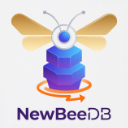

[Read in English](README.md)

<p align="center">
  
</p>

> NewBeeDB 是在 [HNSWIndex.Net](https://github.com/Skaipi/HNSWIndex.Net) 的代码基础上开发的嵌入式向量数据库，可以很方便的用于跨平台的端侧 AI 应用开发。同时，它也为开发更复杂、更大规模向量应用，提供了基础框架。

## 对 HNSWIndex.Net 的主要改进

我在用 Avalonia 开发跨平台应用过程中，发现 C# 社区缺乏支持 Native AOT 的嵌入式数据库，于是在 HNSWIndex.Net 的基础上，魔改了一番，形成现在的 NewBeeDB。主要工作如下：

- 适配 NativeAOT;
- 简化 HNSWIndex.Net 的类型系统，去掉了很多泛型，目前仅支持 float[] 的向量检索，这适用于大多数向量检索场景；
- 添加了索引的序列化和反序列化机制，可以将索引序列化为 zip 文件，也可以从 zip 文件中加载索引；
- 添加了 IBackend 接口，实现了 SqliteBackend(需要引用 `NewBeeDB.Backends` 这个 nuget 包)。如果设置了 SqliteBackend，您对索引的增减操作，可以实时保存在硬盘上。您也可以实现自己的 IBackend 接口。

## 使用示例

### 创建索引、插入、删除与查询

```csharp
HNSWIndex index = new HNSWIndex(HNSWPoint.CosineMetricUnitCompute);
var points = HNSWPoint.Random(128, 100);
foreach(var p in points)
{
    index.Add(p);
}

index.Remove(points[2]);

var queryPoint = points[0];
var match = index.Query(queryPoint, 10);
Console.WriteLine($"Query Point: {queryPoint.Label}");
foreach (var m in match)
{
    Console.WriteLine($"{m.Point.Label} - {m.Distance}");
}
```

HNSWPoint 点的定义如下:

```
public partial class HNSWPoint
{
    public float[] Data { get; set; } = Array.Empty<float>();
    public string Label { get; set; } = String.Empty;
    public int Id { get; internal set; } = -1;
}
```

实际插入时，Label 应该是该点的 key，不同点 key 应不一样。Data 为需要检索的向量，没有维度(数组长度)限制，但是，同一个 HNSWIndex 里所有点的维度应该一样。Id 默认值为 -1，当插入索引后，系统会自动为该点分配一个 Id。

### 索引存储为 zip 文件及从 zip 文件中加载示例

```csharp
string zipFilePath = "hnsw_index.zip";
HNSWIndex index = new HNSWIndex(HNSWPoint.CosineMetricUnitCompute);
var points = HNSWPoint.Random(128, 100);
foreach (var p in points)
{
    index.Add(p);
}
index.SerializeToZipFile(zipFilePath, "demo", sliceMaxCount: 500000);

var loadedIndex = HNSWIndex.DeserializeFromZipFile(HNSWPoint.CosineMetricUnitCompute, zipFilePath, "demo");
var queryPoint = points[0];
var match = loadedIndex.Query(queryPoint, 10);
Console.WriteLine($"Query Point: {queryPoint.Label}");
foreach (var m in match)
{
    Console.WriteLine($"{m.Point.Label} - {m.Distance}");
}
```

上例中，索引会存储为名为 hnsw_index.zip 的压缩包里的 demo.xxxx 等相关文件。使用不同的 name，可以将多个 HNSWIndex 索引存储在一个压缩包里。由于 c# 里 MemoryStream 有长度限制，当索引特别大时，会自动分片存储。sliceMaxCount 是分片参数，每 sliceMaxCount 个点，会存储为压缩包里单独的桶文件。对于 512 维的 float 向量，`sliceMaxCount: 500000` 是一个合适的经验参数。

### SqliteBackend

用 zip 文件来存储，非常消耗时间和计算资源。有时，我们需要一个后端，实时存储索引的修改。NewBeeDB 提供了 `IBackend` 接口，可以自定义后端。`NewBeeDB.Backends` 这个 nuget 包提供了一个 Sqlite Backend 实现。

```csharp
using var backend = new SqliteBackend("demo.db");
var parameters = new HNSWParameters();
var hnsw = new HNSWIndex(HNSWPoint.CosineMetricUnitCompute, parameters, backend);
var points = HNSWPoint.Random(32, 1000, true);
foreach (var p in points)
{
    hnsw.Add(p);
}

Console.WriteLine($"HNSWIndex generated, total - {hnsw.Count}");

var hnsw2 = backend.Load(HNSWPoint.CosineMetricUnitCompute);

if(hnsw2 == null)
{
    Console.WriteLine($"Load from backend failed");
    return;
}

Console.WriteLine($"hnsw == hnsw2: { hnsw.Equals(hnsw2)}");

var queryPoint = points[0];
var match = hnsw2.Query(queryPoint, 10);
Console.WriteLine($"Query Point: {queryPoint.Label}");
foreach (var m in match)
{
    Console.WriteLine($"{m.Point.Label} - {m.Distance}");
}
```

## 大型应用

单个 HNSWIndex 适合 1000万以下的数据。如果需要支持更大规模的数据，需要进行分片处理，每个片是单独的1个 HNSWIndex。需要自行实现相关逻辑。